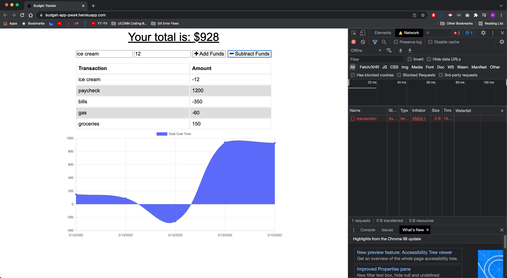

# budget-app
## Progressive Web Applications (PWA) Challenge: Budget Tracker App

## Summary 
In this application, I used PWA (progrssive web applications) to be able to use my code both on and offline, thus allowing the user to interact with the application at any time while still having their data saved on their local machine, then once a connection is re-established, that data will be pushed to a live application and stored online.

## User Story
```
GIVEN a budget tracker without an internet connection
WHEN the user inputs an expense or deposit
THEN they will receive a notification that they have added an expense or deposit
WHEN the user reestablishes an internet connection
THEN the deposits or expenses added while they were offline are added to their transaction history and their totals are updated
```

## Technologies Used
- MongoDB/Atlas
-Mongoose
-Node.js
-Express.js

## Screenshots





## Author
Nicholas E Mendez
